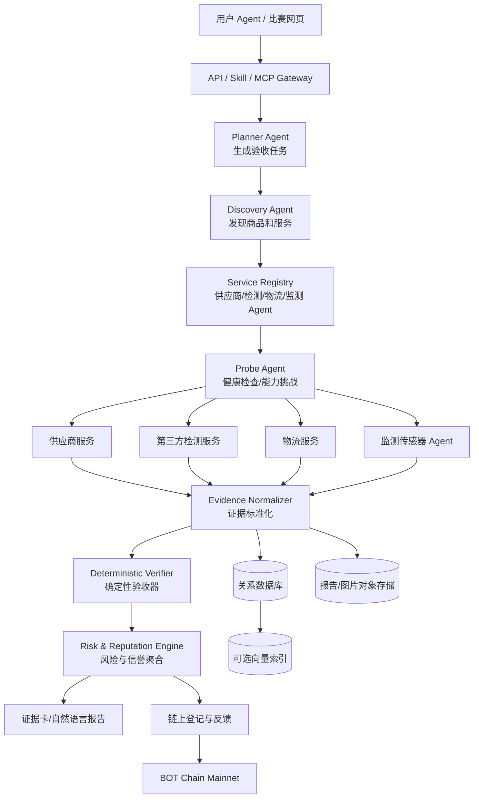

# 真验 v0.2：燕窝批次透明化 Demo 完整架构（历史方案）

> 当前比赛 Demo 已切换为鱼油批次验收，详见 [../README.md](../README.md) 和 [fish-oil-development-plan.md](fish-oil-development-plan.md)。

## 1. 这次 Demo 的边界

团队最新决定用燕窝作为直观示例，但真验的核心仍然是赛题一要求的：

> Agent 面对陌生的供应商、检测和交付服务时，先探测服务，再验收任务结果，把本次结果变成其他 Agent 可以查询的公共信息。

燕窝只是一个垂直场景。首版系统只证明：

- 某个燕窝批次由哪些服务参与；
- 生产、检测、出厂和物流证据是否完整；
- 检测报告是否和批次、时间、签名对应；
- 当前调用的检测或供应服务是否可用；
- 本次验收结果能否被后续 Agent 复用。

首版不做以下事情：

- 不判断燕窝对疾病或健康的治疗效果；
- 不根据用户手环数据给出医疗建议；
- 不把模拟数据包装成真实硬件检测；
- 不声称“上链以后商品自动变真”；
- 不做完整商城、支付、DAO 或积分代币经济。

Demo 页面使用“燕窝滋补品批次质检透明化”的表述，避免把比赛作品说成医疗或保健功效认证系统。

## 2. 用户看到的最终效果

用户不需要安装真验 App。用户自己的 Agent 可以通过 API、Skill 或 MCP 工具访问真验：

```text
用户：帮我看看这盒燕窝值不值得买。

用户 Agent → 真验 API
真验 → 查询批次、服务、检测和公共反馈
真验 → 返回结构化证据
用户 Agent → 用自然语言告诉用户结论
```

比赛网页是观察和演示界面，包含：

1. 燕窝商品和批次概览；
2. 生产、检测、出厂和物流时间线；
3. 质检报告表格；
4. 厂商自报、第三方证明、传感器观察的来源标记；
5. 风险解释；
6. 认证反馈数量；
7. 链上记录和证据哈希；
8. 一个可以调用真验查询接口的对话框。

## 3. 总体架构



## 4. 数据分层

### 4.1 关系数据库

真实性判断需要结构化字段，建议使用 MySQL/PostgreSQL/SQLite 保存：

```text
Supplier              供应商
Product               商品
Batch                 商品批次
ProcessEvent          生产工序事件
Service               可调用服务
Evidence              原始证据摘要
Attestation            第三方或设备证明
VerificationTask      验收任务
VerificationResult    验收结果
Feedback              公共反馈
LedgerEntry           积分/账本记录（后续）
```

### 4.2 对象存储

保存检测报告、图片、扫描件和原始传感器文件。数据库只保存地址、媒体类型、哈希、来源和权限。

### 4.3 向量数据库

向量数据库只解决两个问题：

- 用户用自然语言描述商品时，召回相关商品和证据；
- Agent 根据报告内容检索相关解释。

它不负责判断报告是否真实。批次、时间、签名和数值范围必须由关系数据库和规则引擎判断。比赛 MVP 可以使用一个很小的向量索引；如果依赖安装不稳定，先用关键词检索也不影响核心验收。

## 5. 核心数据对象

### 5.1 批次

```json
{
  "batchId": "SWALLOW-2026-001",
  "productId": "swallow-nest-ready-to-eat",
  "supplierId": "supplier-a",
  "producedAt": "2026-10-06T08:00:00Z",
  "quantity": 1000,
  "status": "partially-verified"
}
```

### 5.2 证据信封

```json
{
  "evidenceId": "ev-qc-001",
  "batchId": "SWALLOW-2026-001",
  "type": "quality-report",
  "issuer": "lab-agent-01",
  "sourceKind": "third-party-lab",
  "issuedAt": "2026-10-06T10:20:00Z",
  "payloadUri": "object://reports/ev-qc-001.json",
  "payloadHash": "0x...",
  "signature": "0x...",
  "revoked": false
}
```

### 5.3 验收任务

```json
{
  "taskId": "task-swallow-001",
  "purpose": "batch-quality-check",
  "batchId": "SWALLOW-2026-001",
  "requiredEvidence": ["production", "quality", "outbound"],
  "rules": {
    "requireThirdPartyAttestation": true,
    "maxEvidenceAgeDays": 30,
    "requireBatchMatch": true
  }
}
```

## 6. 可信数据如何产生

数据来源按可信边界分成三类：

| 来源 | 能证明什么 | 限制 |
|---|---|---|
| 厂商自报 | 生产时间、批次、流程声明 | 不能单独证明真实 |
| 第三方检测 Agent | 检测结果、报告和签名 | 需要验证机构身份和报告对应关系 |
| 平台设备/传感器 | 某时刻的环境或设备观察 | 只能证明设备观察到的内容 |

最终验收至少要求两个独立来源交叉支持关键字段。比如厂商声明“已完成质检”，还需要检测服务报告和批次匹配；设备记录缺失时，结果只能是“部分验证”。

## 7. Agent 和工具边界

### Planner Agent

把“判断这盒燕窝是否值得买”拆成：

- 找到商品批次；
- 查询生产记录；
- 查询质检报告；
- 查询出厂和物流记录；
- 检查第三方证明；
- 生成通过、部分验证或拒绝结论。

### Probe Agent

先调用：

```text
GET  /health
GET  /capabilities
POST /probe
```

历史评分高但当前离线的服务不能被选择。

### Evidence Agent

只负责抓取、解析、标准化和保存证据，不直接修改验收结果。

### Verifier

只执行确定性规则：

- 批次是否匹配；
- 报告时间是否合理；
- 签名是否有效；
- 数据字段是否完整；
- 是否满足第三方证明要求；
- 证据是否过期或已撤销。

### Reputation Agent

根据任务结果生成反馈：

```text
服务当前可用性
任务是否完成
交付是否满足要求
证据是否被验收
响应延迟
是否发生撤销或争议
```

## 8. API 和 Skill 边界

首版建议提供五个接口：

```text
POST /v1/tasks/verify-batch
GET  /v1/batches/:batchId
GET  /v1/batches/:batchId/evidence
GET  /v1/services/:serviceId/reputation
POST /v1/feedback
```

如果用 MCP 暴露给用户 Agent，工具可以是：

```text
search_verified_products
inspect_batch_evidence
check_service_health
verify_batch
get_public_reputation
```

Agent 只能通过工具读取和提交任务，不能直接写数据库或任意调用链上合约。

## 9. 区块链最小功能

合约只做公共锚定：

```solidity
registerService(serviceId, metadataURI)
registerBatch(batchId, productHash)
anchorEvidence(batchId, evidenceHash, issuer, evidenceType)
recordVerification(taskHash, resultHash, score, status)
recordFeedback(serviceId, taskHash, score, evidenceHash)
revokeRecord(recordId, reasonHash)
```

不上链的内容：原始报告、用户健康数据、完整生产配方、个人信息和大文件。

## 10. 积分账本的定位

积分账本不是 MVP 的核心，也不能用积分数量替代信誉。

如果时间充足，积分只用于记录：

- 用户完成一次真实反馈；
- 第三方检测 Agent 完成一次可验证任务；
- 发现并提交有效的证据矛盾。

首版只做链下事件和简单账本记录，暂不发行代币，不设计兑换和金融激励。

## 11. 演示流程

1. 页面展示 `SWALLOW-2026-001` 批次；
2. 用户 Agent 请求判断商品证据；
3. 真验发现三个服务：一个历史分高但当前离线，一个报告批次错误，一个正常；
4. Verifier 发现错误报告并拒绝；
5. 正常服务通过批次、时间、签名和第三方证明检查；
6. 页面显示质检表、证据时间线、来源标签和风险解释；
7. 将验收结果和证据哈希写入 BOT Chain；
8. 第二个 Agent 查询公共记录，复用本次服务信誉。

## 12. 当前讨论缺失的决策

### 必须在开发前确定

1. Demo 的燕窝形态：即食燕窝、干燕盏，还是燕窝饮品。建议只选一种。
2. 所有演示数据是否明确标记为 `demo/synthetic`。
3. `JUV/JEV` 的准确含义、输入输出和负责人。它应当被定义成事件验证/规则层，不能只写成一个模型名。
4. DeepSeek 的调用方式、备用模型和无 API 时的降级逻辑。
5. BOT Chain 钱包、部署账户和合约地址由谁保管。
6. `gev api` 的准确名称、协议和返回格式。当前讨论中的名称还不够明确。
7. 向量数据库是否真的需要外部服务。建议先做可替换接口，避免部署依赖阻塞比赛。

### 必须在演示前补齐

1. 厂商自报、第三方证明和设备观察的来源标签。
2. 通过、部分验证、拒绝、证据缺失、服务离线五种状态。
3. 一条异常证据和一条撤销记录。
4. API 调用日志和工具调用审计。
5. 断网、模型超时和服务不可用时的规则引擎降级。
6. README 中的启动命令、演示账号和链上交易链接。

## 13. 开发顺序

```text
P0  数据模型、证据验收、服务探测、证据卡、演示数据
P1  Agent 工具层、向量检索、链上锚定、公共反馈
P2  用户反馈、监测 Agent、积分账本、真实设备接入
```

两位开发者不拆分同一条代码链：一人维护主代码和集成，另一人维护架构、数据契约、验收标准、PPT 和演示素材。双方先冻结 JSON/API 契约，再并行工作，最后由主代码负责人统一合并和验收。
